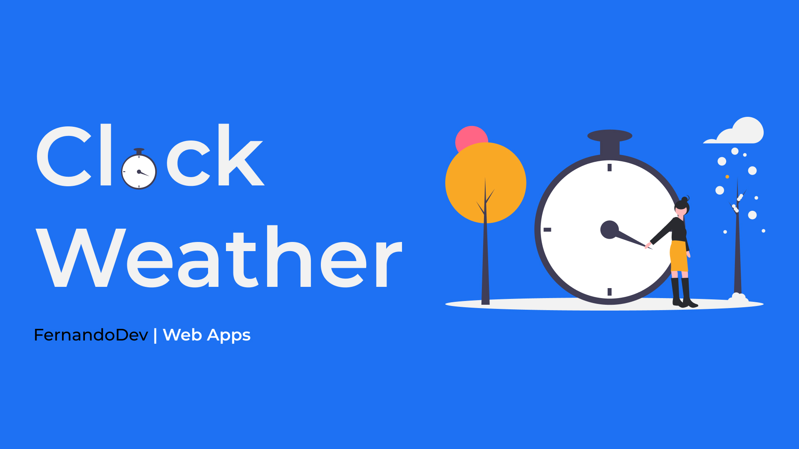

# About this project

**Clock Weather App** was created to access in a fastest and easy way. Moreover, you could know your own weather conditions anywhere you are. This project's design was inspired on Frontend Mentor. Feel free to edit code and fix bugs if you find some of them.

# Preview

If you want to view the live version of this one. [Press here](https://clock-weather.netlify.app)

# API's use in this project

I need some help, that is why I work with three API's to make this project come to life.   API's use were:

-[JavaScript Geolocation API](https://developer.mozilla.org/en-US/docs/Web/API/Geolocation_API) 
-[Open Cage Geocoding API](https://opencagedata.com/) 
-[Open Weather API](https://openweathermap.org/) 

# Compatibility
If you access to the web on Brave Browser, there could be some issues. Because, Brave browser does not run geolocation API correctly, well for now that's what I know.

Moreover, you need to enable GPS on your phone and computer to run the web correctly.

Now you will see an alert, if your browser is different of chrome or safari. Just to notice, that active state background will be a little bit different of the original version.

</img>